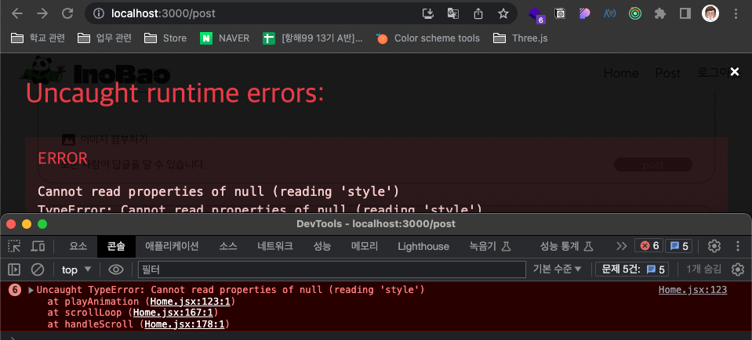

# Inocam Week4 - TEAM 9 

## INOBAO


### 이노베이션 캠프의 소소한 이야기를 함께 나눠봅시다. 
- 이노베이션 캠프의 비공식 대나무숲 커뮤니티 사이트
- 오늘의 트러블슈팅이 있다면 함께 나눠보고, 서로 해결해봅시다.
- 즐거운 일상이 있다만 함께 나눠봅시다. 


<details>
<summary>Page 상세내용</summary>

#### Route
  |page|설명|
  |:--|:--|
  |Home|인터렉티브를 활용한 반응형 Home |
  |Post |이노캠 사용자들의 대나무숲 커뮤니티|
  |Login, Register|로그인과 화원가입 페이지|
  |Admin|관리자 페이지|

#### page 컴포넌트
  |src > page|컴포넌트 설명|
  |:--|:--|
  |App.jsx| Router 설정|
  |Home.jsx|인터렉티브를 활용한 반응형 Home |
  |Post.jsx|이노캠 사용자들의 대나무숲 커뮤니티(게시글, 댓글)|
  |PostWrite.jsx|이노캠 사용자들의 대나무숲 커뮤니티 생성|
  |Login.jsx|로그인 페이지|
  |Register.jsx|화원가입 페이지|
  |Admin.jsx|관리자 페이지|
  |NotFound.jsx|존재하지 않는 페이지 진입시|
  |ErrorBoundery.jsx|에러 발생시 진입 페이지|
</details>

<details>
<summary>라이브러리 관련</summary>

  |라이브러리|버전|라이브러리 설명|
  |:--|:--:|:--|
  |axios|^0.0.0|비동기 통신을 위한 프로미스 가반 라이브러리|
  |dayjs|^0.0.0|날짜 포멧팅을 위한 라이브러리|
  |react-router-dom|^0.0.0|SPA 기반 React에서의 라우팅 처리를 위한 라이브러리|
  |@reduxjs/toolkit react-redux|^0.0.0|전역 또는 네트워크 상태 관리를 위한 라이브러리|
  |styled-compononts|^0.0.0|Css in JS|
  

</details>


### 트러블슈팅
1. 이상준 : 이메일 중복확인
    - 이메일 중복확인 하는 서버 경로를 입력할 때, 쿼리스트링을 기록하는 부분에서 `템플릿 리터럴` 사용("따옴표"로 접근했을 때의 어려움 )

      ```javascript
      const response = await fetch(`http://3.38.246.234:8080/api/auth/email?email=${email}`, {})
      ```

2. 박영찬 : widow 객체 선언시의 에러 
    - 전역에 등록한 `scroll` 이벤트에 대해서 등록해제를 하지 않음에서 발생한 문제
    - Home 페이지 이외의 다른 라우터 에서도 스크롤 이벤트가 발생되며 `handleScroll`를 호출하지만, 해당 라우터에서 값을 참조하지 못함으로 에러발생
    - useEffect 를 통헤 해당 컴포넌트가 언마운트 될 때, 전역에 등록한 `scroll` 이벤트를 해제함으로 문제를 해결 
    <br/><br/>

    ```jsx
    useEffect(() => {
        setLayout();
        window.addEventListener("load", setLayout); // 새로고침 시에도 대응할 수 있도록
        window.addEventListener("resize", setLayout); // 리사이징 시에도 대응할 수 있도록

        const handleScroll = () => {
          yoffset = window.scrollY;
          scrollLoop();
          setCount(currentScene);
        }

        window.addEventListener("scroll", handleScroll); // 스크롤 이밴트 발생 

        return () => {
          window.removeEventListener("load", setLayout);
          window.removeEventListener("resize", setLayout);
          window.removeEventListener("scroll", handleScroll); // 라우터가 변경되어도 전역 window 등록한 scroll 가 동작하여 에러발생
        }
    }, [currentScene]);
    ```

    